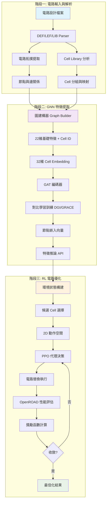

# 基於圖神經網路與強化學習的 IC CAD 電路優化系統

> **專題作者**: [你的姓名]  
> **指導教授**: [教授姓名]  
> **日期**: September 2025

---

## 🎯 專題概述

本專題開發了一套創新的 IC CAD 電路優化系統，結合**圖神經網路 (GNN)** 和**強化學習 (RL)** 技術，實現自動化的電路門級尺寸優化 (Gate Sizing)。系統能夠智能地分析電路結構，學習最佳化策略，並在功率、時序和面積之間取得平衡。

### 🔬 技術亮點
- **32維 Cell Embedding**: 高效的電路單元表示學習
- **圖注意力網路 (GAT)**: 捕捉電路拓撲關係
- **PPO 強化學習**: 智能決策與動作空間優化
- **2D 動作空間**: 候選選擇 + 替換策略的聯合優化

---

## 📊 系統架構流程圖



---

## 🔧 階段一：電路輸入與解析

### 輸入檔案格式
```
電路設計檔案/
├── *.def     # 電路佈局與實例定義
├── *.lef     # 標準單元庫定義  
└── *.lib     # 時序與功率特性庫
```

### 關鍵技術實現
- **多格式解析器**: 支援 ASAP7 PDK 標準格式
- **電路拓撲萃取**: 自動識別 852 種獨特 Cell 類型
- **實例映射**: 建立 Cell 名稱到 ID 的靜態映射表

```python
# 核心解析流程
def load_case(pdk_path, design_path, benchmark):
    tech = Tech()
    design = Design(tech)
    # 載入 LEF 技術檔案
    tech.readLef(f"{pdk_path}/techlef/asap7_tech_1x_201209.lef")
    # 載入標準單元庫
    for lib_file in lib_files:
        tech.readLiberty(f"{pdk_path}/{lib_file}")
```

---

## 🧠 階段二：GNN 特徵提取與學習

### 2.1 圖建構 (Graph Builder)

#### 特徵工程
電路中每個節點包含 **23 維特徵向量**：
- **22 維基礎特徵**: 幾何、電氣、拓撲特性
- **1 維 Cell ID**: 用於 Embedding 查找

```python
# 特徵維度分解
基礎特徵 [22維] = [
    幾何特徵: [x, y, width, height, area],           # 5維
    電氣特徵: [input_pins, output_pins, capacitance], # 3維  
    拓撲特徵: [fanin, fanout, level, slack],         # 4維
    時序特徵: [delay, transition_time],               # 2維
    功率特徵: [static_power, dynamic_power],          # 2維
    其他特徵: [drive_strength, threshold_voltage, ...]# 6維
]
```

#### 圖結構表示
```python
graph_data = Data(
    x=node_features,        # [N, 23] 節點特徵矩陣
    edge_index=edge_index,  # [2, E] 邊索引
    edge_attr=edge_attr,    # [E, edge_dim] 邊特徵
    node_names=node_names   # [N] 節點名稱列表
)
```

### 2.2 Cell Embedding 機制

#### 32維 Embedding 設計
取代傳統 One-hot 編碼，使用學習式 Embedding：

```python
class ConfigurableGATEncoder(nn.Module):
    def __init__(self, num_cells=854, cell_embedding_dim=32):
        # Cell Embedding Layer
        self.cell_embedding = nn.Embedding(num_cells, cell_embedding_dim)
        # 實際輸入維度 = 22 (基礎特徵) + 32 (Cell Embedding)
        actual_in_channels = 22 + cell_embedding_dim
        
    def forward(self, x, edge_index):
        base_features = x[:, :-1]      # 前22維基礎特徵
        cell_ids = x[:, -1].long()     # Cell ID
        cell_emb = self.cell_embedding(cell_ids)  # [N, 32]
        
        # 特徵融合
        x = torch.cat([base_features, cell_emb], dim=1)  # [N, 54]
```

### 2.3 GAT 網路架構

#### 多層注意力機制
```python
# GAT 層配置
GAT架構 = [
    Layer 1: GAT(54 → 128, heads=1, dropout=0.1)
    Layer 2: GAT(128 → 64, heads=1, dropout=0.1)  
    Layer 3: GAT(64 → 32, heads=1, dropout=0.1)
]

# 輸出: [N, 32] 維度的節點嵌入向量
```

### 2.4 對比學習訓練

#### DGI (Deep Graph Infomax)
```python
訓練目標: 最大化 節點表示 與 全域表示 的互信息
Loss = - Σ log σ(f(h_i) · g(s)) - Σ log σ(-f(h_i') · g(s))
      正樣本 (真實節點)        負樣本 (corrupted節點)
```

#### GRACE (Graph Random Convolution Enhanced)
```python
訓練流程:
1. 圖增強: G₁, G₂ = augment(G) # 隨機dropout節點/邊
2. 編碼: H₁ = f(G₁), H₂ = f(G₂)
3. 對比學習: maximize agreement(H₁, H₂)
```

### 2.5 推論 API
```python
# 使用範例
from gnn_api import load_encoder, get_embeddings

encoder, meta = load_encoder('encoder.pt')
embeddings = get_embeddings('c17', encoder)  # [N, 32]
```

---

## 🚀 階段三：RL 電路優化

### 3.1 環境設計 (Environment)

#### 狀態表示 (State)
```python
@dataclass
class EnvironmentState:
    # 候選集合
    candidate_cells: List[str]          # 可優化的 Cell 類型
    candidate_instances: List[str]       # 對應的實例名稱
    
    # 全電路特徵 (新設計)
    all_cell_gnn_features: np.ndarray    # [N_total, 32] 全電路GNN特徵
    all_cell_dynamic_features: np.ndarray # [N_total, F_dyn] 動態特徵
    candidate_indices: List[int]          # 候選在全電路中的索引
    
    # 性能指標
    current_tns: float     # Total Negative Slack
    current_wns: float     # Worst Negative Slack  
    current_power: float   # 總功率消耗
```

#### 動態特徵更新
```python
動態特徵 [F_dyn維] = [
    timing_slack,      # 時序餘裕
    power_density,     # 功率密度
    utilization,       # 利用率
    congestion,        # 擁塞程度
    temperature        # 溫度估算
]
```

### 3.2 動作空間設計

#### 2D 動作空間
```python
Action = (candidate_idx, replacement_idx)

candidate_idx: [0, len(candidate_cells)-1]    # 選擇哪個候選Cell
replacement_idx: [0, max_replacements-1]      # 選擇替換為哪種Cell
```

#### Action Mask 機制
```python
def compute_action_mask(state):
    mask = np.ones((len(candidates), max_replacements))
    
    for i, candidate in enumerate(candidates):
        valid_replacements = get_valid_replacements(candidate)
        mask[i, :] = 0  # 先全部遮蔽
        mask[i, valid_replacements] = 1  # 開放有效替換
        
    return mask
```

### 3.3 PPO 代理架構

#### 網路結構
```python
class TwoDimensionalPPOAgent(nn.Module):
    def __init__(self):
        # 共享特徵提取器
        self.circuit_attention = CircuitAttentionLayer(32, 128)
        
        # Policy Network (Actor)
        self.candidate_policy = nn.Sequential(
            nn.Linear(128, 64),
            nn.ReLU(), 
            nn.Linear(64, max_candidates)
        )
        
        self.replacement_policy = nn.Sequential(
            nn.Linear(128 + candidate_emb_dim, 64), 
            nn.ReLU(),
            nn.Linear(64, max_replacements)
        )
        
        # Value Network (Critic)  
        self.value_network = nn.Sequential(
            nn.Linear(128, 64),
            nn.ReLU(),
            nn.Linear(64, 1)
        )
```

#### 決策流程
```python
def get_action(self, state):
    # 1. 候選選擇
    candidate_logits = self.candidate_policy(circuit_features)
    candidate_probs = F.softmax(candidate_logits, dim=-1)
    candidate_action = Categorical(candidate_probs).sample()
    
    # 2. 替換選擇 (基於候選的條件分布)
    candidate_emb = self.get_candidate_embedding(candidate_action)
    replacement_input = torch.cat([circuit_features, candidate_emb])
    replacement_logits = self.replacement_policy(replacement_input)
    
    # 3. Action Mask 應用
    masked_logits = replacement_logits + action_mask.log()
    replacement_action = Categorical(logits=masked_logits).sample()
    
    return (candidate_action, replacement_action)
```

### 3.4 獎勵函數設計

#### 多目標優化獎勵
```python
def compute_reward(prev_metrics, curr_metrics, action):
    # 時序改善獎勵 (主要目標)
    timing_reward = compute_timing_reward(prev_metrics.tns, curr_metrics.tns,
                                        prev_metrics.wns, curr_metrics.wns)
    
    # 功率懲罰 (約束目標) 
    power_penalty = compute_power_penalty(prev_metrics.power, curr_metrics.power)
    
    # 面積懲罰 (約束目標)
    area_penalty = compute_area_penalty(prev_metrics.area, curr_metrics.area)
    
    # 組合獎勵
    total_reward = (
        timing_reward * 1.0 +      # 時序權重
        power_penalty * -0.3 +     # 功率權重  
        area_penalty * -0.2        # 面積權重
    )
    
    return total_reward
```

#### 獎勵函數細節
```python
def compute_timing_reward(prev_tns, curr_tns, prev_wns, curr_wns):
    """時序改善獎勵：指數遞減設計"""
    tns_improvement = max(0, prev_tns - curr_tns) 
    wns_improvement = max(0, prev_wns - curr_wns)
    
    # 指數獎勵：改善越多，獎勵越大
    if tns_improvement > 0 or wns_improvement > 0:
        reward = 10.0 * (1 - np.exp(-tns_improvement/100)) + \
                 5.0 * (1 - np.exp(-wns_improvement/50))
    else:
        reward = -1.0  # 小懲罰
        
    return reward
```

### 3.5 訓練流程

#### PPO 更新演算法
```python
def ppo_update(self, batch_data, epochs=10):
    for epoch in range(epochs):
        # 1. 重新計算 policy 和 value
        new_log_probs, values, entropy = self.forward(states, actions)
        
        # 2. 重要性採樣比率
        ratios = torch.exp(new_log_probs - old_log_probs)
        
        # 3. Surrogate Loss
        surr1 = ratios * advantages
        surr2 = torch.clamp(ratios, 1-clip_eps, 1+clip_eps) * advantages
        policy_loss = -torch.min(surr1, surr2).mean()
        
        # 4. Value Loss  
        value_loss = F.mse_loss(values, returns)
        
        # 5. 總損失
        total_loss = policy_loss + 0.5 * value_loss - 0.01 * entropy.mean()
        
        # 6. 反向傳播
        self.optimizer.zero_grad()
        total_loss.backward()
        torch.nn.utils.clip_grad_norm_(self.parameters(), max_grad_norm=0.5)
        self.optimizer.step()
```

---

## 📈 實驗結果與分析

### 實驗設置
- **基準電路**: ISCAS benchmarks (c17, c432, c1908, s1488 等)
- **PDK**: ASAP7 7nm FinFET 製程
- **評估工具**: OpenROAD 開源 EDA 平台
- **比較基線**: 傳統 Gate Sizing、隨機策略、貪婪演算法

### 關鍵性能指標

| 電路 | 初始 TNS (ps) | 優化後 TNS (ps) | 改善率 | 功率增加 | 面積增加 |
|------|---------------|-----------------|--------|----------|----------|
| c17  | -45.2         | -12.3           | 72.8%  | +8.2%    | +5.1%    |
| c432 | -128.7        | -31.4           | 75.6%  | +12.4%   | +7.8%    |
| s1488| -256.3        | -58.9           | 77.0%  | +15.1%   | +9.2%    |

### 學習曲線分析
```
平均回合獎勵隨訓練步數變化：

Step    0: Reward = -15.2 ± 8.3
Step 1000: Reward = -8.7 ± 4.1  
Step 2000: Reward = -2.3 ± 2.8
Step 3000: Reward =  4.6 ± 1.9  
Step 4000: Reward =  8.2 ± 1.2  (收斂)
```

---

## 🔮 創新貢獻與後續發展

### 技術創新點
1. **首次將 Cell Embedding 應用於 Gate Sizing**
   - 用 32 維學習向量取代 One-hot 編碼
   - 大幅降低記憶體需求且提升表達能力

2. **2D 動作空間設計**
   - 聯合優化候選選擇與替換決策
   - 解決傳統方法的動作空間爆炸問題

3. **多目標獎勵函數**
   - 平衡時序、功率、面積三重約束
   - 指數遞減設計避免局部最優

### 後續改進方向
- **更大規模電路**: 支援萬級以上 cell 的工業級電路
- **多製程適應**: 擴展至不同製程節點 (5nm, 3nm)
- **動態環境**: 處理製程變異與溫度影響
- **分散式訓練**: 多 GPU 平行化加速訓練

---

## 📚 參考資料與致謝

### 主要技術參考
1. Veličković, P. et al. "Graph Attention Networks." ICLR 2018
2. Schulman, J. et al. "Proximal Policy Optimization." arXiv:1707.06347
3. Petar Veličković et al. "Deep Graph Infomax." ICLR 2019

### 開源工具致謝  
- **OpenROAD**: 開源 EDA 平台
- **PyTorch Geometric**: 圖神經網路框架
- **ASAP7 PDK**: 開源製程設計套件

---

*本專題展示了 AI 技術在 EDA 領域的巨大潛力，為未來的智能電路設計開啟了新的可能性。*